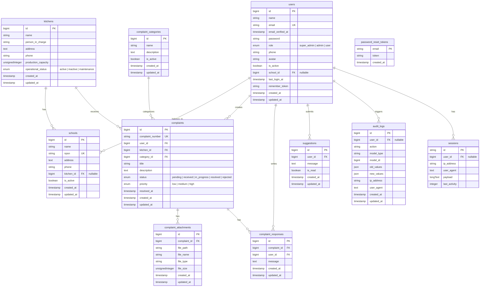

# ERD — MBG Project

## Catatan Relasi

| Parent | Child | Tipe | Kunci |
|--------|-------|------|-------|
| `users` | `schools` | Many-to-One | `users.school_id` → `schools.id` |
| `kitchens` | `schools` | Many-to-One | `schools.kitchen_id` → `kitchens.id` |
| `users` | `complaints` | Many-to-One | `complaints.user_id` → `users.id` |
| `kitchens` | `complaints` | Many-to-One | `complaints.kitchen_id` → `kitchens.id` |
| `complaint_categories` | `complaints` | Many-to-One | `complaints.category_id` → `complaint_categories.id` |
| `complaints` | `complaint_attachments` | One-to-Many | `complaint_attachments.complaint_id` → `complaints.id` |
| `complaints` | `complaint_responses` | One-to-Many | `complaint_responses.complaint_id` → `complaints.id` |
| `users` | `complaint_responses` | Many-to-One | `complaint_responses.user_id` → `users.id` |
| `users` | `suggestions` | Many-to-One | `suggestions.user_id` → `users.id` |
| `users` | `audit_logs` | Many-to-One (nullable) | `audit_logs.user_id` → `users.id` |
| `users` | `sessions` | Many-to-One (nullable) | `sessions.user_id` → `users.id` |
